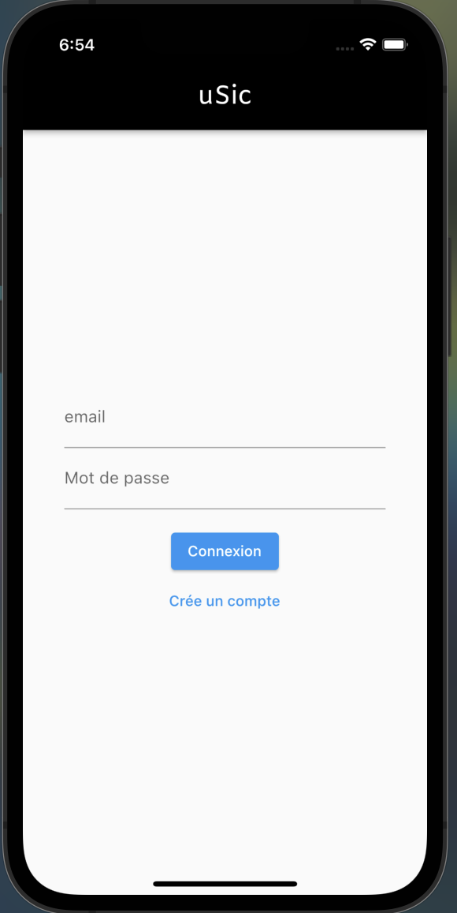
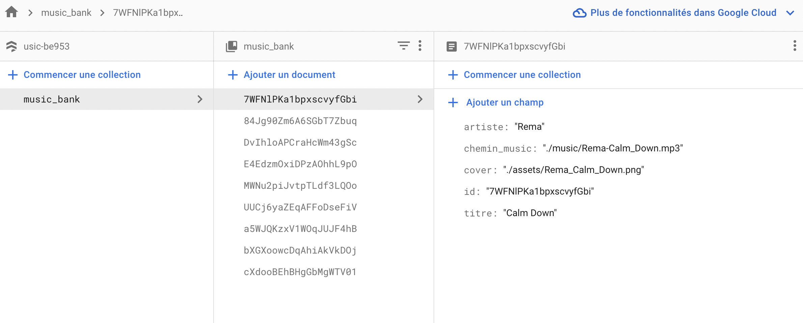
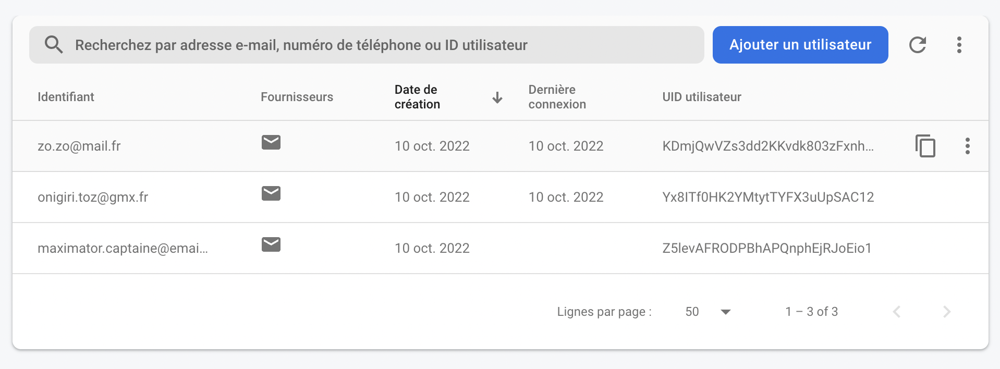

# uSic (clone Spotify)

## Pre-requis
Il faut dans votre machine installer flutter https://docs.flutter.dev/get-started/install/macos

trop gentil j'ai mis le lien ☝️

Je pense que le premier demarrage peut-etre très long

## Introduction

le projet a pour but de faire un clone d’application de music en `flutter`. Il faudra interagir avec une BDD. Elle sera deployée avec `Docker` 
> J'avais la flemme de faire la Dockerisation car il aurait fallu que je passe par android studio pour lancer des emulateur etant donné que l'image macos n'existe pas...

## BDD

### New 
La base de donnée tourne maintenant sur firebase dans le cloud, de plus les comptes users sont maintenant disponible et il faut se connecter pour avoir accès aux musics. 


### Old
La base de donnée est pour le moment en `sqlite` elle est de plus déployé via `docker` .

Pour lancer la base de données, il faut avoir docker sur ça machine, l’execution de celle-ci passe par un `docker compose`. Dans le repertoire `my_app` executer la command :

```bash
docker compose up
```

Cette commande crera et lancera le contener.


La base de donnée est composé d’une premère table `music_bank`:

### SQlite version


### Firebase version



la base de donnée des `users` est séparée dans la partie `Authentification` sur `Firebase`:


## Application

Une application est composée de 2 parties, avec le `backend` et le `frontend` dans notre cas nous allons utilisé qu’un seul langage pour consillier les 2. 

`Flutter` est un framework du langage de google `Dart`. Nous pouvons avec cette technologie faire des logiciel, des apps web et surtout ce qui va nous interreser des application mobile.

Pour le moment nous executons que via `Visual Studio code` sur un emulateur ios l’application flutter.

### Utilisation l’application

Ce clone d’application de music ce composera de 2-3 page de navigation avec une liste de musique, la page de la musique lancer, et l'obligation de s'authentifier.


Il suffit de cliquer sur une music puis d’appuyer sur play pour jouer la music.

> Pour lancer l'application :
Etant un appli mobile il faut un `device` pour cela sur mac: on peut ouvrir l'application `Simulator` soit en ligne de commande :
```bash
open -a Simulator
```
ou directement en le cherchant dans les applications. Il faudra alors creer un device si ce n'est pas déjà fait.

Maintenant il faut ce rendre une fois le depot cloné, dans le `dir` ``my_app`` puis en ligne de commande :

```bash
flutter run
```

> Il est plus simple d'executer un via un IDE permettant de relier un device plus facilement  

Une fois l'app dépployée, creer un compte afin d'avoir accès à l'app.

> Un fichier test est pésent il permet de tester la connection de la BDD.
## TODO

- [x]  BDD
    - [x]  Crée la base de données
    - [x]  dockeriser la base de données
    - [x]  remplir la base de données
    - [x]  passer la base de données sur Firebase
    - [x]  Implementer la table users
- [ ]  Flutter
    - [x]  Crée la homePage
    - [x]  crée la page de lecture
    - [x]  Crée la page auth
    - [x]  CRUD
    - [x]  afficher les données de la table music_bank de la base de données
    - [x]  changer naviger entre les pages
    - [x]  gerer l’audioPlayer qui lance et arrete la musique
    - [x]  implementer le slider qui gere la position de la musique
    - [x]  faire des test 
    - [ ]  Conteneriser via docker
- [ ]  Optionnel
    - [ ]  gerer les appBar
    - [ ]  implementer graphiquement tout les crud
    - [ ]  mettre un thème sombre
    - [ ]  cree des compte user
    - [ ]  pouvoir gerer la music dans la bottumappBar
    - [ ]  Clean Code
    - [ ]  gerer l’arborescence des fichiers
