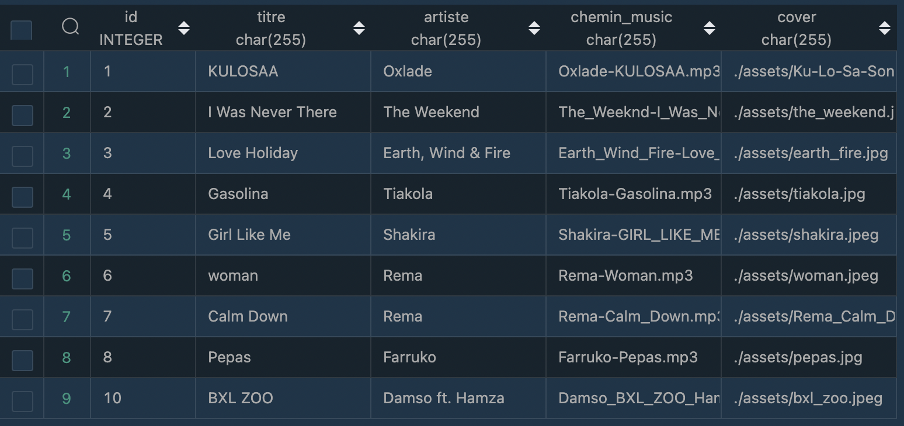
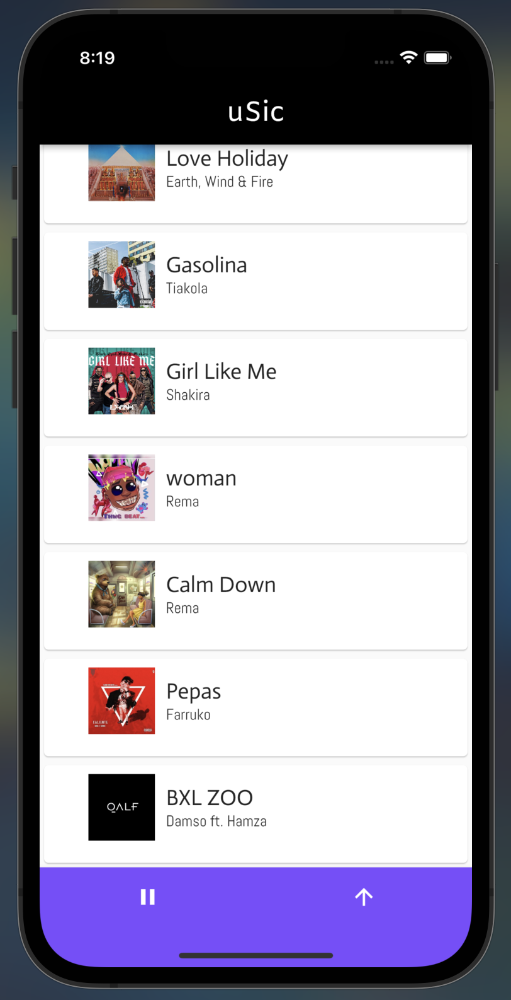
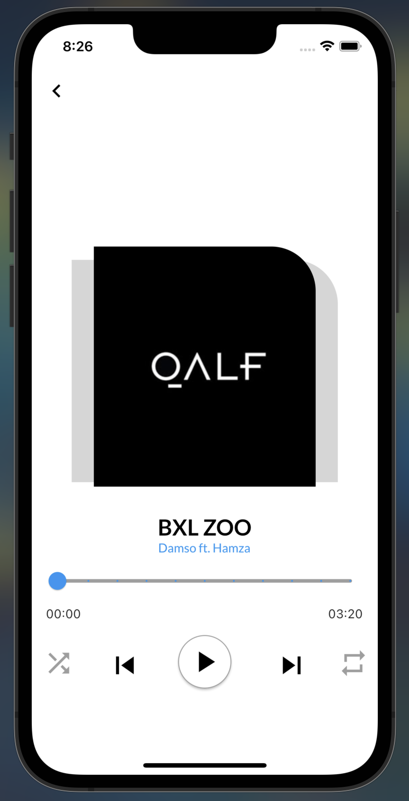

# Music Pro (clone Spotify)

## Introduction

le projet a pour but de faire un clone d’application de music en `flutter`. Il faudra interagir avec une BDD. Elle sera deployée avec `Docker`

## BDD

La base de donnée est pour le moment en `sqlite` elle est de plus déployé via `docker` .

Pour lancer la base de données, il faut avoir docker sur ça machine, l’execution de celle-ci passe par un `docker compose`. Dans le repertoire `my_app` executer la command :

```bash
docker compose up
```

Cette commande crera et lancera le contener.

> Par la suite nous essayerons avec cette base de passer sur `Firebase`.
> 

La base de donnée est composé d’une premère table `music_bank`:




Par la suite une table user sera developpée…

## Application

Une application est composée de 2 parties, avec le `backend` et le `frontend` dans notre cas nous allons utilisé qu’un seul langage pour consillier les 2. 

`Flutter` est un framework du langage de google `Dart`. Nous pouvons avec cette technologie faire des logiciel, des apps web et surtout ce qui va nous interreser des application mobile.

Pour le moment nous executons que via `Visual Studio code` sur un emulateur ios l’application flutter.

### Utilisation l’application

Ce clone d’application de music ce composera de 2-3 page de navigation avec une liste de musique, la page de la musique lancer, et à l’avenir une page de connections.






Il suffit de cliquer sur une music puis d’appuyer sur play pour jouer la music.

## TODO

- [ ]  BDD
    - [x]  Crée la base de données
    - [x]  dockeriser la base de données
    - [x]  remplir la base de données
    - [x]  passer la base de données sur Firebase
    - [ ]  Implementer la table users
- [ ]  Flutter
    - [x]  Crée la homePage
    - [x]  crée la page de lecture
    - [ ]  Crée la page auth
    - [ ]  gerer les appBar
    - [x]  CRUD
    - [x]  afficher les données de la table music_bank de la base de données
    - [x]  changer naviger entre les pages
    - [x]  gerer l’audioPlayer qui lance et arrete la musique
    - [x]  implementer le slider qui gere la position de la musique
    - [ ]  faire des test de front et de back
    - [ ]  Conteneriser via docker
- [ ]  Optionnel
    - [ ]  implementer graphiquement tout les crud
    - [ ]  mettre un thème sombre
    - [ ]  cree des compte user
    - [ ]  pouvoir gerer la music dans la bottumappBar
    - [ ]  Clean Code
    - [ ]  gerer l’arborescence des fichiers
